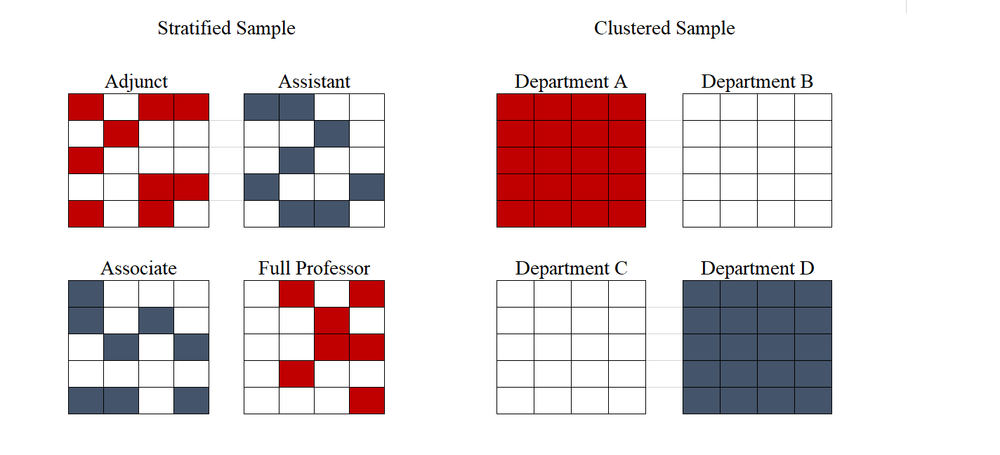
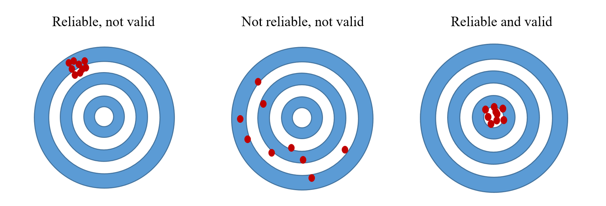
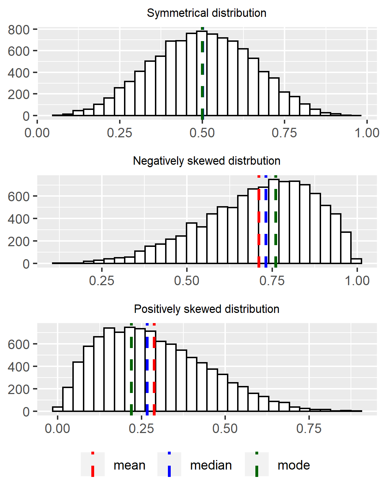

# Data

**By Pilar Manzi**

## Introduction

Authoritarianism, corruption, ideology, partisanship, populism, public mood, civil war, social movements\... these are all common phenomena studied in Political Science. Yet what exactly do these terms mean? (Un)fortunately, there is no single way to define them. Although there is, of course, some consensus as to what these terms generally refer to, a clear definition of the concept can vary across researchers according to what best fits their research question. Defining a concept is one of the most essential steps in the research process.

Once a concept has been precisely defined, the next step is to determine what the concept looks like in reality. In this stage, researchers need to think about what observable characteristics will help them identify which units are representations of the concept. The measurement of the concept involves deciding what information must be collected and how that information will be interpreted. For instance, what does it mean for a country to have "low levels of political freedom\"? First, we need to determine what is contemplated under "political freedom\" (eg. does it include freedom of speech? Freedom of the press? Freedom to compete in elections?). Then, we must identify what information is available in order for us to evaluate the level at which these freedoms are respected. Will we consider the number of journalists or political opponents under arrest? The presence or absence of constitutional rights guaranteeing free speech? Finally, what makes a level of political freedom high or low?

At the heart of this discussion is data, since we cannot measure a concept without it. Although the word data is used to describe different things (such as a data point or a dataset), we can understand it as the information we collect to characterize the units we are studying. There are many methods of data collection, some of which are discussed throughout the book. But be it through surveys, experiments, or secondary sources, we need to understand what type of information we have at hand. Data can vary according to the unit of analysis, the level of analysis, the time period and the level of measurement. They can refer to a sample, or to a population. In every case, we must identify what we are working with and what each type of data will allow us to do.

With the data in hand, we can proceed to summarize and describe this information. This is called **descriptive statistics**, and it allows researchers to present data in meaningful ways and potentially discover interesting patterns. The basic tools of descriptive statistics include measures of central tendency (mean, median and mode) and measures of spread (eg. range and standard deviation). Descriptive statistics only allow researchers to speak about the data at hand. Yet, in many cases, the final goal is to make predictions about a larger population, which is the task of **inferential statistics**. Different statistical tools allow researchers to use information from the sample to then make generalization (or inferences) about the broader population from which the sample was taken.

## Types of Variables

In order to use data to operationalize your concept, first we must understand that not all of our variables are of the same kind. Since we are working with numerical data, they will fit into one major category of "quantitative" variables. This means that, even if our data is not necessarily a number, it is being represented by one and fit into a dataset. "Qualitative" variables, on the other hand, are things such as extracts of speeches or historical documents. These cannot be fit into a dataset without serious transformation or coding.

Within quantitative variables, we have important distinctions. The first way to separate them is between categorical and numerical variables. As its name suggests, categorical variables are those that represent categories, or groups. Categorical variables can be further grouped into two distinct types: nominal and ordinal. **Nominal** variables are those that hold categories that cannot be hierarchically ordered in any way. Country names, regime types (eg. democracy, monarchy, dictatorship) and party identification (eg. Democrat, Republican), are all examples of nominal variables. **Ordinal** variables, on the other hand, can be ordered in a sequence yet we cannot establish an exact distance between them. In surveys, it is common to see response scales such as: strongly disagree, disagree, agree, strongly agree. Although we know that a person who answered \"strongly disagree\" has a stronger negative stance than a person who \"agrees\", we cannot say how much more that person is in disagreement.

The second broad type of variables are numerical. These variables are operationalized as numbers and thus allow us to both establish an order and to determine the exact distance between one observation and another. Within numerical variables we find **continuous** variables, which can take on any number. This is the case of a country's GDP or a family's household income, for example. **Discrete**, or count variables, are only integer numbers. For instance, a measure of the amount of votes in the House of Representatives is a discrete variable, since there cannot be 155.3 votes.

1.  **Check-in question:** How could age be operationalized (turned into) as different types of variables?*

As we will discuss later, the type of descriptive analysis we can carry out varies according to the type of variable. Generally speaking, numerical data gives us more room for statistical analysis. With categorical data, the descriptive analysis is more limited. For this reason, it is advisable to collect data at the most detailed level, when possible. Say you are interested in measuring a generational effect over political participation. One way to do so would be to ask people in what age bracket they fall into (corresponding to each generation). However, if further in your research you realize there might be a more fine-grained age effect, you would need people's actual age in years. With a measure of people's age, you can both analyze the direct age effect and also group people into generations. Indicators of democracy are usually based on indices of continuous or discrete nature, and are then **aggregated** into ordinal or nominal variables for ease of description. The Economist Intelligence Unit's Index Democracy Index ranges from 0 to 10 and is then classified into: Authoritarian regime (scores under $4$), Hybrid regime ($\geq{4}<{6}$), Flawed democracy ($\geq{6} and <{8}$), and Full democracy ($8-10$). Similarly, the Polity IV score is a number from $-10$ to $10$ and this score is then categorized into Autocracy ($-10$ to $-6$), Anocracy ($-5$ to $5$), and Democracy ($6$ to $10$).

## Types of Data

These quantitative variables will be compiled in the form of a dataset, which can also be categorized according to the type of information they hold. The first thing to note in a dataset is what the unit of analysis is. A **unit of analysis** is that for which information is being collected. For instance, most surveys are at the individual level, since they collect information about people's point of view on different subjects. Household surveys, which are usually carried out by national institutions to collect information about the population, ask both for data on individuals and for the household/family level. Questions regarding access to water and heat, value of the property, and expenditure on groceries are measured for the household as a whole. In a study on the position of Representatives, the unit of analysis are legislators, while in a study on the characteristics of bills passed, the unit of analysis are the bills. Many available datasets on socioeconomic/demographic statistics of the world have countries as the unit of analysis. Research on Regional Trade Agreements (eg. NAFTA, Pacific Alliance, Southern Common Market) has an even broader unit of analysis, since these agreements encompass several countries.

One distinction to keep in mind is between unit of analysis and **level of analysis**. The unit of analysis where information is collected. Yet, we might want to present data at a more aggregate level. Survey data is frequently compared across groups. In this case, although the unit of analysis is individuals, their opinions are averaged across variables such as race, educational level or urban/rural, among others. Similarly, global comparisons of welfare or economic indicators tend to be presented at the regional level (eg. Western Europe, Latin America, Sub-Saharan Africa) or by income groups (eg. High Income, Lower-Middle Income) though the data was collected for each country.

Another way of categorizing data is by considering units and time. **Cross-sectional data** is one where several units are compared, yet only at one point in time -- like a survey or a measurement collected once. A dataset that has multiple measures over time is called **time series data**. However, the multiple measures are not collected from the exact same unit. If a poll is repeated every three months, yet the respondents vary each time, it falls under this category. Regional surveys, such as the Afrobarometer, Latinobarometro and the European Social Survey are conducted at regular intervals. If only one wave of the survey is being analyzed, it is considered a cross-section data; when several waves are included in the analysis, it becomes a time-series, cross-section data.

If the same respondents answered the poll every time the survey is conducted, it is considered a **panel data**. Panel data is distinct because it follows the exact unit over time. The British Household Panel Survey (BHPS) is an example of a panel study. In 1991, the BHPS began surveying a sample of around 5,500 households (10,000 individuals). Every year since, the BHPS returns to these households to re-survey its members. The resulting data has enormous potential for researching variation across a person's life, such as the effects of parenting on employment and gender roles or how political interest evolves as a person ages [@fraile2019; @borell-porta2018; @kuziemko2018]. A dataset with country indicators across time (such as the World Development Indicators) can also be considered panel data. In this case, the measurement of a certain indicator is being collected in several occasions, and thus we can follow the changes of that indicator across time.

1.  **Check-in question:** Consider the following description of a survey carried out in Uruguay: \"Estudio Longitudinal del Bienestar en Uruguay (ELBU) is a cohort study carried out (\...) to perform multidimensional well-being assessments. The study follows a representative sample of households with children that were attending the first year of primary school at public institutions in Montevideo and urban areas in 2004 (\...) To date, four waves have been carried out in 2004, 2006, 2011/12 and 2015/16 and the fieldwork of a fifth one is being carried out.\" [^6] What type of data is this? What is the population being studied?*

## Samples and Sampling

Before embarking on data collection, we must be clear as to what population we are interested in exploring. Most of the time, especially when our population is composed of individuals (as opposed to more aggregate units, such as countries), it is very hard to collect information about the entire population of interest. This is why we have **samples**: we collect information about a group of people from that population to learn about the population as a whole. We want this sample to be as similar as possible to the population, so who we select for our sample is of paramount importance for the reliability of our findings. There exist two major sampling methods: probability and nonprobability sampling. **Probability sampling** means that the probability of a certain sample of being selected is known, whereas in **nonprobability sampling** it is unknown. Good research will be typically based on probability sampling.

Probability sampling is also known as random sampling. A **random sample** means that every person in the population of interest has the same probability of being chosen for the sample; and that every sample of size $n$ has an equal chance of being chosen. Random samples can be simple or take on slightly more complex forms, discussed below. A special property of all random samples, if large enough, is that they guarantee they will resemble the actual population. This is derived from the Law of Large Numbers: as the sample size increases, the sample statistics (like the mean of the sample) get closer and closer to the population parameters (like the population mean).

As mentioned, there are different kinds of random samples. The first, **simple random sample**, refers to a basic randomization of all subjects in the population. If we were to research university professors at a certain school, a simple random sample could be constructed by obtaining a list of all the hired professors (our **sampling frame**), assigning a number to each individual, and then randomly selecting a certain amount of numbers, previously determined by considering the amount of resources available as well as establishing a certain minimum number of cases to reduce bias in the sample.

In some cases, sample selection requires more sophisticated methods. Two additional types of random sampling are stratified random sampling and cluster random sampling. Note that these too belong to the groups of probability sampling. **Stratified sampling** is useful when we want to compare groups (\"strata\") and thus we want to guarantee that our sample will have a certain amount of subjects from each group. Once the population is divided into these groups, a random sample is selected from each one. Stratified sampling is only possible if we have the necessary data to group our population according to the category of interest. For instance, if the main interest of the professor survey is to compare differences among professors of different ranking, we could conduct a stratified sample based on this information, since it is readily available. Yet, it would be harder to stratify the sample based on personal income. Recall that, to stratify sample on a given variable, the information needs to be available for the whole sampling frame.

**Cluster sampling** is sometimes confused with stratified sampling, yet they are used for different purposes and the sampling procedure is distinct. Clusters are also groups of subjects, yet they are not constructed to compare them with each other. On the contrary, clusters should ideally have heterogeneity within, yet not differ greatly from other clusters. Once subjects are grouped in clusters, clusters are selected through a simple random method; all of the individuals within the selected clusters are in the sample. Following the above example, instead of walking around all campus in search of our survey respondents, we could cluster professors by Department and survey all professors of the randomly selected clusters (Departments).

{width="90%"}

Not all surveys use probabilistic sampling, and you should be very wary of these. One type of sampling method under this category is **convenience sampling**. As its name suggest, this method implies selecting individuals that are most accessible. Most online polls have this characteristic: the sample will be composed of people who accessed certain websites where the poll was posted and decided to take their time to answer it. A convenience sample could also consist of surveying your soccer team when your research is about soccer fans across the country. **Snowball sampling** is another type of nonprobability sampling. This method is usually used when studying certain vulnerable or hidden populations that are harder to reach through normal sampling methods (eg. people with AIDS). With this technique, a survey respondent will provide referrals who will be recruited to become part of the study.

Nonprobability samples suffer from a major problem called **sampling bias**. With these techniques, the resulting sample is far from reflecting the actual population. The online poll example will be a representation only of those people who are exposed to the poll and who feel compelled to answer it, which has been shown to be nonrandom. Deciding to only survey your soccer team will yield biased results as well. You will be representing only a certain age group, from a certain neighborhood who probably share socio-economic status and educational level. The results from this poll will not provide any information on soccer fans across the country, but only of one limited, unrepresentative portion of them.

Although the risks of falling into sampling bias is much lower with random sampling, this might still occur. For instance, while it used to be common to survey people through landline telephone surveys, this will nowadays exclude a significant part of the population. For this reason, pollsters such as Pew Research Center combine random sampling from both landline and cellphone numbers. This method ensures that practically all of the U.S. population will be covered (according to Pew, only 3% of households have no phone access).[^7]

There are other types of biases that researchers must be aware of, both for random and nonrandom samples. One of these is **non-response bias**, referring to subjects that do not wish to participate or answer certain questions, or when subjects cannot be reached. The differences between those that chose to respond and those that do not are usually nontrivial. For instance, people who participate in a poll of a given subject tend to have stronger feelings for it. If a pollster is calling people at 10am, people who are at work will probably refuse to answer, and the differences between their opinions and non-working people opinions are usually not random. This is why pollsters attempt contact at different times of day and different days of the week. Other types of biases can arise from question wording, social desirability or respondent fatigue. You can learn about these in [ch06](./surveys.html).

Finally, no matter how well designed your sampling method is, your results will always have some **sampling error**. Sampling error accounts for the fact that your results do not correspond to the population, but to your sample. Inevitably, there exists variation between these two. The sampling error is also called **margin of error**, and it depends on how many subjects are in your sample and on how dispersed our data is. As mentioned previously, the law of large numbers states that, the larger the sample, the closer the estimate will be to the actual population value. Note, however, that usually around 1,500 observations is large enough to represent a country. In fact, most of the regional survey mentioned above, such as Afrobarometer and Latinobarometer, survey between 1000 and 1200 subjects in each country. Though the margin of error continues getting smaller as the size surpasses 1500, the gains are usually not worth the costs of surveying more people. On the other end, the margin of error does vary substantially for lower sample sizes.

Since we can never be $100\%$ confident that our result is exactly the same as the population value, we must always calculate the margin of error to represent the uncertainty of our estimates. Failing to consider this uncertainty is one of the most common ways of misinterpreting survey results. Going back to the example of your survey of university professors: imagine your sample size is of 200 cases, with a margin of error of 8 percentage points. Your estimates show that, among tenured professors, the average score of student evaluations is of $72\%$ , while for non-tenured professors it is $78\%$. This could lead you to erroneously conclude that non-tenured professors have higher student evaluations. In reality, given such high margin of error, we cannot claim any difference between the scores. Our estimate of non-tenured teacher evaluations are actually between $71\%$ and $86\%$ ($78\% \pm 8$), while tenured professor evaluations are between $64\%$ and $80\%$ ($72\% \pm 8$).

In sum, surveys are an essential tool in data collection, but must be designed carefully in order to avoid common pitfalls. First, be aware of problems related to sampling. When encountering surveys, always evaluate if the sample on which the study was done is representative of the population for which conclusions are being drawn. A study performed on a sample of students from your cohort will only speak to the opinions of students from your university and your cohort. Finally, yet very importantly, recall that survey estimates will always have some variation from the actual \"reality\". You must take into account this uncertainty and evaluate the results with their corresponding margin of error.

1.  **Check-in question:** The headline of a news article reads: \"Candidate X will win the elections by a large margin: poll shows 52% of people support her, while Candidate Y is only backed by 43%.\" Why is this headline misleading? What key piece of information is missing to correctly interpret the difference in electoral support between the candidates?*

## Measurement

Another aspect we must take into consideration before data collection is specifically how our concept will be measured, or operationalized. Whichever our data collection process is, we must be certain that what we are measuring corresponds to the concept we wish to study. A good measurement must be reliable and valid. **Reliability** means that every time you measure you should obtain the same results. **Validity** refers to the fact that the measure actually represents the concept we are interested in. As the figure below illustrates, a measure can be reliable if all measures consistently capture the same phenomenon, yet not valid if this phenomenon is not the same as our concept. It can be neither reliable nor valid if it does not consistently measure the same thing and that thing is not our concept. A measure that is both reliable and valid will be correctly capturing our concept in every iteration.

{width="50%"}

Problems of measurement are present beyond the use of surveys. Take the concept of democracy, for which we can find at least 10 different measures. The first differences among these measures is the way they are conceptualized, or defined. This step requires researchers to establish which attributes will be considered. Democracy measures usually include some combination of: political rights, political participation, freedom of speech, civil liberties, competitive elections, free and fair elections, etc. Then they vary according to which indicators they chose for each attribute. What piece of information do I consider to evaluate if a country has free elections? Will I code this as a simple dichotomous variable (free/not free)? Or will it be a numerical variable that captures the degree of freedom in elections? Lastly, since all measures of democracy are in the form of an index, there must be an aggregation rule. Are the scores of each attribute added or multiplied? Does each indicator weight the same? All of these decisions will yield different results. Table [\[table: data\_democracy\]](#table: data_democracy){reference-type="ref" reference="table: data_democracy"} below, adapted from [@munck2009] illustrates how three different measures of democracy are constructed. Note that the table omits two further elements that distinguish the measures: the specific indicators chosen for each component and the aggregation rules.

| Name of index                                                  | Attributes                       | Components of attributes    | Measurement level |
|----------------------------------------------------------------|----------------------------------|-----------------------------|-------------------------------|
| 3*(alvarez1996) | Contestation                                 |                                         | Nominal                       |
| (1)3-4                                                | 2* Offices             | Election executive                      | Nominal                       |
|                                                 |                                              | Election legislature                    | Nominal                       |
| 6* (bollen1980)                             | 3* Political liberties | Press freedom                           | Interval                      |
|                                                                            |                                              | Freedom of group opposition             | Interval                      |
|                                                                            |                                              | Government sanctions                    | Interval                      |
|                                                                            | \\multirow\{3\}\{\*\}\{Popular sovereignty\} | Fairness of elections                   | Interval                      |
|                                                                            |                                              | Executive selection                     | Interval                      |
|                                                                            |                                              | Legislative selection and effectiveness | Interval                      |
| 52.5cm Polity IV (marshall2001)         | Competitiveness of participation             |                                         | Ordinal                       |
|                                                                            | Regulation of participation                  |                                         | Ordinal                       |
|                                                                            | Competitiveness of executive recruitment     |                                         | Ordinal                       |
|                                                                            | Openness of executive recruitment            |                                         | Ordinal                       |
|                                                                            | Constraints on executive                     |                                         | Ordinal                       |

**Table 4.1: Conceptualization and measurement of democracy, according to different authors, source: Adapted from (Munck 2009)**

One concrete example of how a \"small\" change in measurement can substantially change a measure of democracy comes from Paxton [@paxton2000], who analyzes scholarly literature that indicates when a country democratized. She scrutinizes authors' definitions of democracy, which in most cases consider a country to become democratic when suffrage is universalized. However, these definitions are not always consistent with the dates coded as transitions, since female suffrage is introduced much later. Switzerland is one of the most clear cases: women were allowed to vote only in 1971, yet all of the authors contemplated in Paxton's study consider it to have been a democracy since the 19th century.

No matter how careful we are in the operationalization of our concept, there will always be some error in our measurement. Yet, not all errors will have the same effect on our results. Systematic errors, or systematic bias, are the most damaging. **Systematic bias** occurs when we are consistently making a mistake in our measurement. In a scientific lab experiment, for instance, our experiment will have systematic bias if our measuring tool is not calibrated correctly, and so every single measure will be off to some extent. When conducting surveys, systematic bias results from errors in sampling (sampling bias), but also from factors such as question wording and order. This bias also occurs with other data collection methods. Following Paxton, if an author identifies a transition to democracy when suffrage is truly universalized, yet considers countries where women did not have the right to vote as democracies, then this is a case of systematic bias.

While systematic bias generally follows a pattern, **random measurement error** is due to chance. As opposed to systematic bias, random error does not have a distinct upward or downward bias, and thus it does not have a significant impact on our results. In other words, we might be off in our measurement, but our errors are randomly distributed throughout our data; they do not have a distinct upward of downward direction. Essentially, all or the errors should balance each other out and average out to zero. When we use Likert scales in surveys (e.g. \"In a scale of 1 to 10, where 1 is strongly disagree and 10 is strongly agree\...\"), some might respond too high and others too low, but, on average, we will capture the spirit behind it. When we have an **unreliable measurement**, however, our amount of random error has become too large. What exactly is too much error is not clear, however.

1.  **Check-in question:** A researcher wants to obtain a measure of average wages in a country. To do so, she collects data from the social security agency, which centralizes information from each company's payroll. Yet, this country has a large informal economy, meaning many workers are paid \"under the table\", and thus will be left out of her measure. What type of error does this represent?*

## Measures of Central Tendency

Once we have collected our data, our first step is to become familiarized with it before doing any complex statistics. We need to get a picture of what the data looks like. A first way of summarizing data is through tables and graphs, such as frequency tables, histograms, bar graphs, etc. Effectively illustrating data is an enormous advantage. In this section, though, we will focus not on tables and graphs but on statistical measures that summarize data. The first family of statistics, the measures of central tendency, are useful to describe the center of the data, what a typical observation is like. There are three measures of central tendency: the mean, the median, and the mode.

The **mean**, also known as the average, is calculated by adding up all the values of that variable and dividing by the amount of observations. It is the most widely used summary statistic since it a balancing point in the distribution and gives a sense of where most values fall near. Of course, given that it involves a mathematical operation, it is only applicable to numeric variables, as opposed to nominal and ordinal ones. One disadvantage of the mean is that it is sensible to outliers. Outliers, or values that are substantially higher or lower than the rest, can pull the mean in that direction, thus resulting in a misleading representation of the typical observation. This is especially true as the sample gets smaller; the smaller the sample, the more each observation weighs. For example, lets consider the average income of the people in a small seminar. The ten attendees are students, whose monthly incomes range from $\$1,000$ to $\$2,600$. Yet, the speaker in the room is a famous businessman who earns $\$60,000$ a month. The average income of the room is $\$7,054$, yet all ten students earn less than $\$3,000$. In this case, the mean is not the most appropriate measure of the \"typical\" observation.

A second measure of central tendency, the **median**, could be a better fit for the above example. The median is the number that marks the center of the distribution when the values are listed in numerical order. It divides the distribution in exactly half. When the number of values is even, the two numbers at the center are averaged. To calculate the median from the above example, we first order the incomes from lowest to highest: $1,000, $1,000, $1,000, $1,100, $1,200, $2,300, $2,400, $2,500, $2,500, $2,600, $60,000. Then we identify the midpoint in the distribution: $2,300. This is a far better representation of the room's average income. Thus, when a certain variable has outliers, the median is usually the preferred method to describe the center. Another advantage it has over the mean is that it can also be used to describe ordinal (but not nominal) data. However,in cases with few response categories, the median can give little information about a distribution. Two sets of numbers could have the same median yet different patterns.

The last measure of central tendency is the **mode**. The mode is the value that is occurs most often. This measure can be used with any type of variable, yet it is especially useful for categorical data. However, if the most common value is not a significant portion of the distribution, the mode might be trivial. Note that a distribution may have more than one value with an exceptionally high occurrence. In our example, the mode was 1,000. Bi-modal distributions are such cases, where the distribution will have two peaks at distinct values. Distributions can also be multimodal, or uniform in cases where all the values have the same frequency.

All three measures are complementary when describing the center of data. Furthermore, having these three measures provides a sense of how the data is shaped. If the mean, median and mode are similar, the distribution is symmetrical. When the mean is below the median and the mode, it means there are extreme values in the lower half of the distribution that are pulling the mean towards that end. This results in a **negatively skewed distribution**. On the contrary, high extreme values pull the mean towards the upper end, thus resulting in a **positively skewed distribution**. In addition, based on the number of modes, we have information on the modality of the distribution.

Whereas the measures of central tendency give us insight into the center of the data and the typical values, measures of dispersion characterize how spread out the data is. One of such measures is the **range**. A range measures how far apart the highest and lowest value are. If votes for Party A are as low as 10% in one region and as high as 90% in another, the range is of 80%. If Party B obtains 25% in the least supportive region and 60% in the most supportive, its range is of 35%. Party B has less variability.

Two other measures of dispersion widely used in statistic are the **variance** and the **standard deviation**. The standard deviation, which is a slight transformation of the variance, is more widely used because it is easier to interpret. Simply put, they measure the average distance of each observation from the mean. Larger standard deviations indicate more dispersion in the data. Note that standard deviation must always be positive: there is no such thing as a negative distance. The calculation of the variance and standard deviation is straightforward, yet requires a few steps:

-   Calculate the mean

-   Subtract each observation from the mean, and square the result ($(x_i -\bar{x})^2$)

-   Add up all squared deviations ($\sum_{i=1}^{N}(x_i -\bar{x})^2$)

-   Divide by the number of observations (n) when dealing with a population or by the number of observations minus 1 (n-1) when dealing with a sample. Up to this point, you have calculated the average distance from each observation to the mean, squared. This is what we call the variance ($\frac{\sum_{i=1}^{N}(x_i -\bar{x})^2}{(n-1)}$). For a more intuitive interpretation, though, we add one more step:

-   Take the square root of the variance to obtain the standard deviation ($\sqrt{\frac{\sum_{i=1}^{N}(x_i -\bar{x})^2}{(n-1)}}$)

In sum, an essential description of any variable should include these basic measures to describe both its typical values and to describe their variation.

## Broader significance/use in political science

The issues discussed in this chapter are encountered in every single research process. In Political Science, and social sciences in general, conceptualization and measurement are particularly contested issues. Given the nature of the discipline, most, if not all of our approaches to research have some degree of subjectivity. This does not mean, however, that they fail to be scientific. But in order to make legitimate and persuasive arguments, we need to make extra efforts to create robust measures of our concepts. These topics are so relevant that an important part of methodological training is focused specifically on them ([@goertz2006; @sartori1970; @collier2009]).

Sampling is also very tightly linked to the Political Science discipline. Particularly when studying individuals, you will frequently encounter research questions that refer to a broad population which is impossible to completely collect data from. This is why good samples are fundamental to the process. Valid and reliable results hinge upon well designed samples.

## Conclusion

Data is (are)[^8] the building blocks of research. Without it, we cannot do science. Yet not all data is equally valuable, and no data is ever objective. Whichever the source of our data is we must be very well acquainted with it and be aware that every one of its characteristic will have different impacts on our results. Keep in mind all the types of bias data may have. Starting with concept formation, be wary that no concept is the same, and make transparent and thoughtful decisions as to why you chose to build and measure the concept the way you do. Also, pay close attention to how the data is being collected. Recognize that none of these choices are neutral, that they all have limitations, and that they will have different consequences on your research. Once you have your data collected, dedicate time to describing your dataset. This will reveal interesting trends and patterns that are valuable in and of themselves, as well as provide you with a useful guide for more advanced statistical analysis.

## Application Questions

1.  Consider the distribution of poverty rates in Latin America. Calculate the measures of central tendency. Which do you think best summarizes the data? What happens if you exclude Haiti from your calculations? What happens if you exclude Uruguay from your calculations?

      Country        Poverty rate
      ------------- --------------
      Argentina           2
      Bolivia            11.8
      Brazil             9.6
      Chile              1.8
      Colombia           10.8
      Costa Rica         2.7
      Dom. Rep.          5.9
      Ecuador            8.7
      El Salvador        8.5
      Guatemala          24.2
      Haiti              50.8
      Honduras           31.6
      Mexico             11.2
      Nicaragua          12.8
      Panama             6.3
      Paraguay           5.6
      Peru               9.8
      Uruguay            0.4

      : Poverty headcount ratio at $\$3.20$ a day (2011 PPP), % of population.

2.  A researcher wants to study ethnic diversity in the city of Chicago. Explain why each of these sampling strategies could work (or not) for this purpose:

    1.  Interviewing the first 200 people they see at their neighborhood Whole Foods.

    2.  Randomly sampling 2 neighborhoods in Chicago and interviewing all their residents.

    3.  Randomly sampling 100 people in each neighborhood of Chicago.

3.  Consider Paxton's study referenced above. Are the measures of democracy that Paxton criticizes valid, reliable, both, or neither?

## Key Terms

-   aggregation

-   bias

-   cluster sampling

-   conceptualization

-   continuous

-   convenience sample

-   coverage bias

-   cross-sectional

-   dichotomous (dummy) variables

-   disaggregation

-   level of analysis

-   longitudinal data

-   margin of error

-   mean

-   median

-   mode

-   nominal

-   ordinal

-   panel data

-   population

-   sample

-   sampling error

-   sampling frame

-   skewness

-   standard deviation

-   systematic measurement error

-   time series data

-   unit of analysis

## Answers to Application Questions

1.  How could age be operationalized as different type of variables? Age could be a discrete variable if asked in whole years or it could be an ordinal variable if asked in intervals (eg. Under 18 years old, Between 18 and 50 years old; Above 50).

2.  Description of Uruguayan Survey. What type of data is this? A panel data. What is the population being studied? Children that attended first grade at public primary schools in Montevideo and urban areas in 2004.

3.  Why is this headline misleading? What key piece of information is missing to correctly interpret the differences in electoral support between the candidates? In order to accurately describe the difference among candidates we need to know what the margin of error is. If the margin of error is of 9%, for example, the support of each candidate would not be different. Support for Candidate X would be between $43\%$ and $61\%$ and support for Candidate Y would be between $34\%$ and $52\%$.

4.  If a researcher wants to measure average wages in a country with a large informal economy, yet she is only considering data from the formal economy, her measurement will have a systematic error because she is leaving out a large portion of workers. Her measure of average wages will probably be inflated, since informal workers tend to get paid less than formal workers.

5.  1.  Mean: $11.9$, Median: $9.15$, Mode: - , Range: $50.4$, Standard Deviation: $12.04$

    2.  By excluding Haiti, the mean lowers to $9.6$, the median $8.7$, the range to $31.2$ and the standard deviation to $7.7$.

    3.  By excluding Uruguay, the mean increases to $12.6$, the median to $9.6$, the range to $49$, and the standard deviation to $12.05$.

    4.  The case of Haiti is particularly disruptive to the mean. When it is included in the calculations, the median is a better representation of the typical poverty levels of the region.

6.  1.  Interviewing the first 200 people in the neighborhood Whole Foods is an example of a convenience sampling. This will surely bias the results for the study since there is low probability that the interviewees represent the ethnic heterogeneity of Chicago's residents.

    2.  Randomly sampling 2 neighborhoods in Chicago and interviewing all their residents could work better than the first alternative, but it still has problems. Given that Chicago is such a segregated city, we run the risk of sampling two very homogeneous neighborhoods. Maybe we sample one neighborhood with mostly White residents and one with mostly Hispanic residents, in which case we would not be considering all other races and ethnic backgrounds.

    3.  Randomly sampling 100 people in each neighborhood of Chicago would be the best option. It would be the most costly, but the sample would probably include people from many ethnic backgrounds.

7.  If an author considers that a country's transition to a democracy occurred when they had universal suffrage, yet they code cases as transitions where only male suffrage was universalized, then this is an example of a reliable, yet not valid measurement. It is reliable if every single case is measured the same way, but not valid because the concept they are measuring does not correspond to their definition of democracy.

[^6]: http://fcea.edu.uy/estudio-del-bienestar-multidimensional-en-uruguay.html

[^7]: https://www.pewresearch.org/methods/u-s-survey-research/our-survey-methodology-in-detail

[^8]: Some prefer data as plural while others refer to data as singular. Either way is fine!
